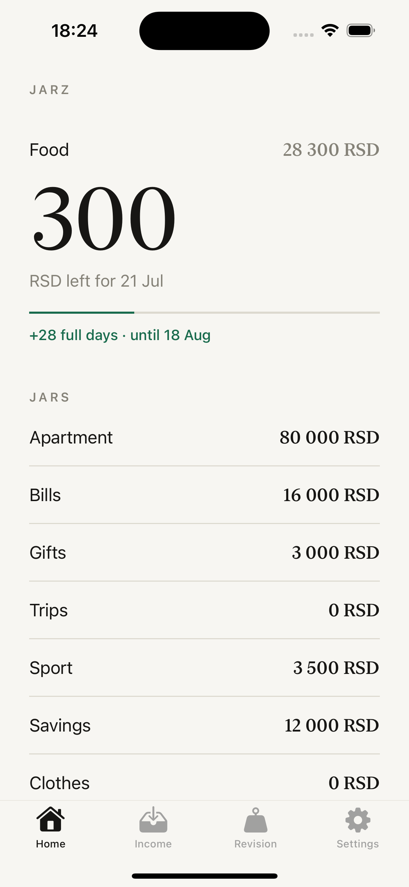
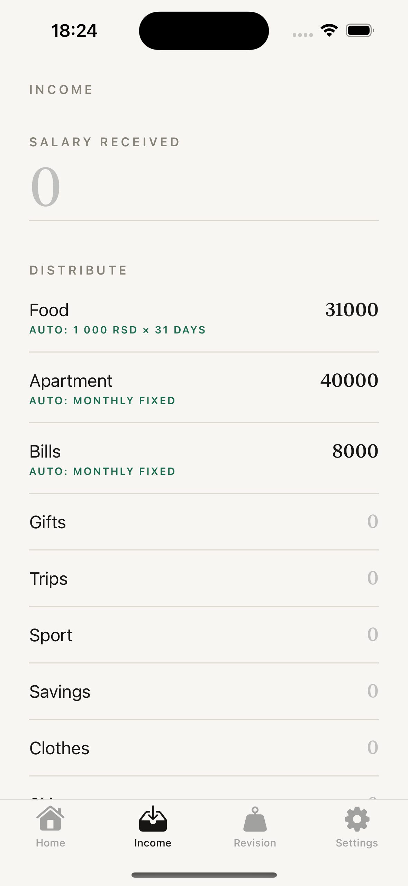
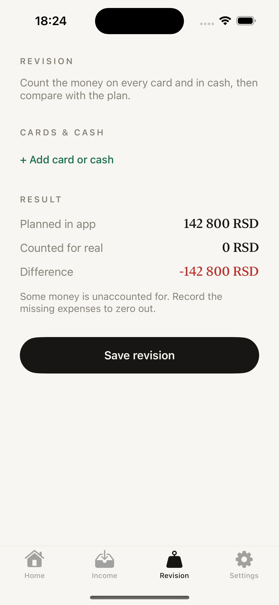
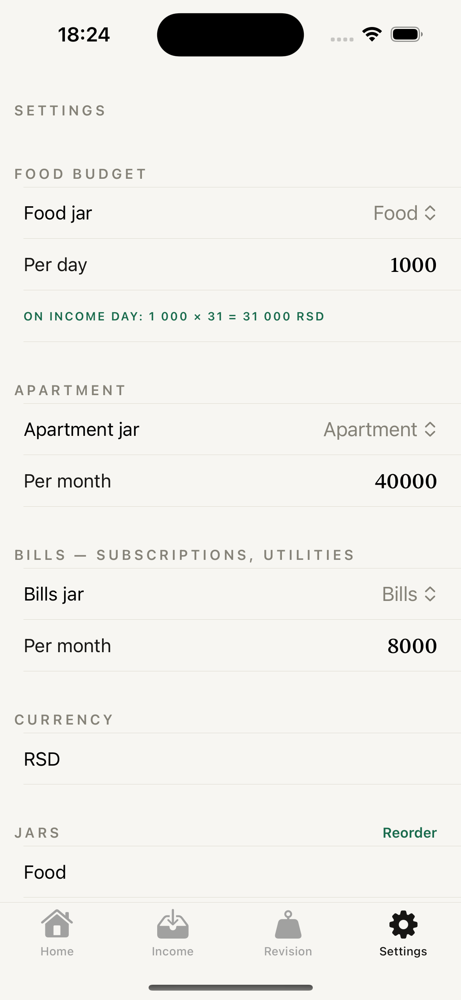

# Jarz — Salary Planner


Jarz is a money **planner**, not an expense tracker. Every payday you split your salary into jars (Food, Rent, Bills, Savings…), every purchase comes out of its jar — so at any moment you know exactly what you can still afford.

## Screenshots

| Home | Income | Revision | Settings |
|---|---|---|---|
|  |  |  |  |

## Features

- **Daily food budget** — set a per-day amount; on payday Jarz sets aside 31 days' worth. The balance is shown as "what's left for the current day + how many full days are covered ahead", driven purely by the remaining money, not the calendar.
- **Fixed costs on autopilot** — rent and bills are pre-filled automatically on the Income screen.
- **Honest balances** — overspent jars go red instead of being blocked.
- **Revision mode** — count the real money on your cards and in cash, compare with the plan, zero out the difference.
- **Fully editable jars** — rename, add, remove, reorder; leftovers carry over between paydays.
- **Local-only** — no account, no cloud, no analytics, no network requests at all.

## Tech

- SwiftUI, iOS 17+
- Clean Swift (VIP): every scene is Interactor → Presenter → ViewStore with Request/Response/ViewModel models
- SwiftData persistence (`StorageWorker`); iCloud sync is code-ready but disabled until a paid developer account (`iCloudSyncEnabled` flag + entitlements in `project.yml`)
- Project generated with [xcodegen](https://github.com/yonaskolb/XcodeGen)

## Building

```sh
brew install xcodegen
xcodegen generate
open Jarz.xcodeproj
```

## App Store

Submission kit (metadata, description, checklist) lives in [APPSTORE.md](APPSTORE.md). Icon drafts are in [IconDrafts/](IconDrafts/). Privacy policy: [antonpenkov1.github.io/jarz/privacy.html](https://antonpenkov1.github.io/jarz/privacy.html).
